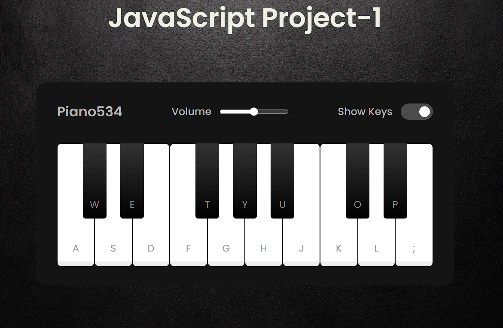

# piano534
 with javascript piano

Certainly! Let’s break down the provided code for building a playable piano using HTML, CSS, and JavaScript:

HTML Structure:
The index.html file sets up the basic structure of the piano.
It includes a 
 to contain the piano components.
Inside the wrapper, you’ll add the header and piano keys.
Styling with CSS:
The style.css file is responsible for styling the piano.
The chosen font is Poppins from Google Fonts.
The background color of the wrapper is set to #141414.
The header contains information about the piano.
The volume slider and checkbox for showing/hiding keys are styled accordingly.
Piano keys are divided into white and black keys.
White keys have a gradient background, while black keys have a darker gradient.
JavaScript Logic:
Although not shown in the provided code, you’ll need to write JavaScript to handle the piano’s functionality.
This includes detecting key presses or mouse clicks on the piano keys.
When a key is pressed or clicked, play the corresponding sound associated with that key.
Adjust volume settings and other features as needed.
Customization:
Feel free to customize the design further. You can change colors, sizes, and add additional features.
For example, you can add labels to the keys, create different piano modes (e.g., grand piano, electric piano), or even add animations.
Remember that this code snippet is just the starting point. You’ll need to add the missing JavaScript logic to make the piano fully functional. Enjoy building your own virtual piano! 🎹🎶
